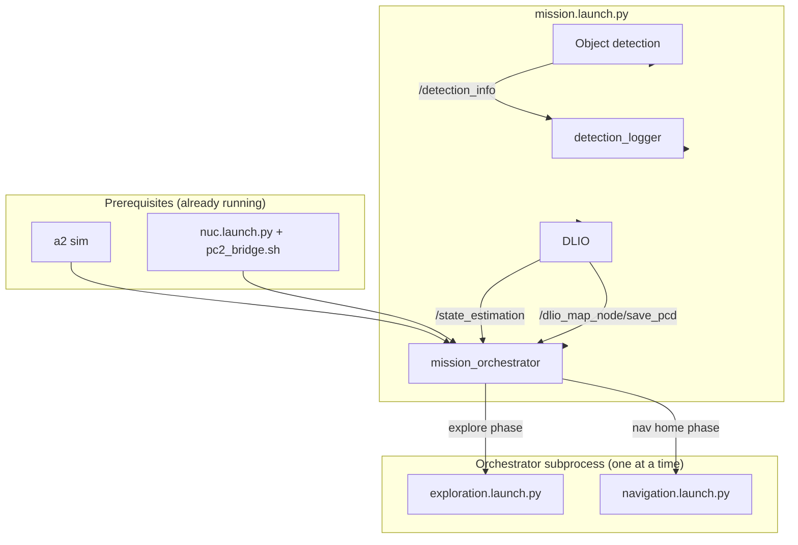
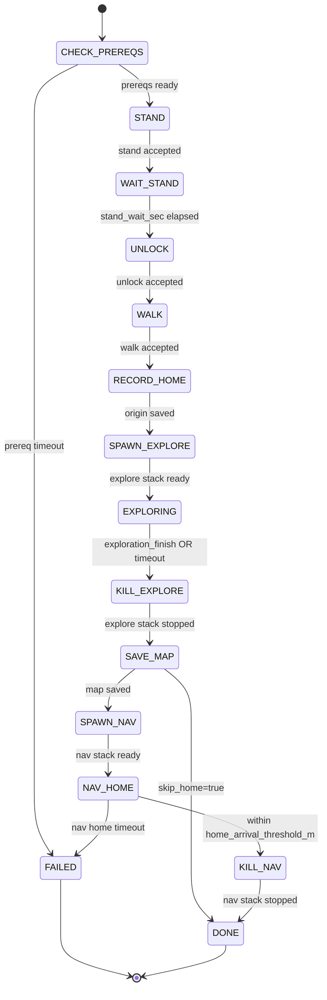

# Autonomous Mission

End-to-end autonomous workflow: bring the robot up, record a home origin, explore until coverage finishes or a timeout, save the DLIO map, and navigate back to origin.

## Architecture

### Prerequisites

The mission launch assumes a running robot stack. Start one of these **before** `mission.launch.py`:

| Environment | Required stack |
|-------------|----------------|
| **Simulation** | `a2 sim` — Gazebo sim, bridge, sensors, and locomotion FSM |
| **Real robot** | `ros2 launch a2_ros nuc.launch.py` on the NUC **and** `bash scripts/pc2/pc2_bridge.sh` on pc2 |

Both paths expose `/a2/set_mode`, lidar, camera, and odometry topics the orchestrator waits on.

### What `mission.launch.py` starts

`ros2 launch a2_ros mission.launch.py` (or `a2 mission`) brings up:

1. **DLIO** — lidar-inertial odometry and mapping (`include_dlio:=true` by default)
2. **Object detection** — sim or real launch selected by `sim_detection`
3. **detection_logger** — writes `save_dir/detections.csv`
4. **mission_orchestrator** — state machine that drives the full mission

The orchestrator **subprocess-spawns** autonomy stacks as needed:

- **`exploration.launch.py`** during the explore phase (TARE planner + autonomy base)
- **`navigation.launch.py`** during the return-home phase (FAR planner + autonomy base)

Only one of these runs at a time. The orchestrator stops exploration before starting navigation.

### High-level component diagram



## Mission flow

1. **Stand / unlock / walk** — request locomotion modes via `/a2/set_mode`
2. **Record origin** — capture home pose from `/state_estimation`, write `origin.txt`
3. **Explore** — spawn `exploration.launch.py`; run until `/exploration_finish` is true **or** `exploration_timeout_sec` elapses (default 600 s)
4. **Save map** — call `/dlio_map_node/save_pcd` to write `clean_map.pcd`
5. **Nav home** — spawn `navigation.launch.py`, publish home on `/goal_point`; complete when within `home_arrival_threshold_m` of origin (unless `skip_home:=true`)

### State flow diagram



## Topics and services

| Name | Type | Role |
|------|------|------|
| `/a2/set_mode` | `a2_interfaces/srv/SetOperatingMode` | Request stand (2), unlock/balance stand (3), or walk (4) |
| `/state_estimation` | `nav_msgs/Odometry` | Pose for recording origin and checking home arrival |
| `/exploration_finish` | `std_msgs/Bool` | TARE planner signals exploration complete |
| `/goal_point` | `geometry_msgs/PointStamped` | Home goal for FAR planner during return navigation |
| `/dlio_map_node/save_pcd` | `direct_lidar_inertial_odometry/srv/SavePCD` | Save voxel-filtered map to `save_dir/clean_map.pcd` |
| `/mission/status` | `std_msgs/String` | Orchestrator state updates (`STATE:detail`) |
| `/detection_info` | `object_detection_msgs/ObjectDetectionInfoArray` | Detections logged to CSV and used during explore |

## Running a mission

### Simulation

```bash
export A2_MODE=sim
a2 sim
a2 mission save_dir:=/tmp/run1 use_sim_time:=true sim_detection:=true camera_image_topic:=/camera/image_raw
```

When `A2_MODE=sim`, `a2 mission` also passes `use_sim_time`, `sim_detection`, and `camera_image_topic` automatically if omitted.

### Real robot

```bash
export A2_MODE=robot
ros2 launch a2_ros nuc.launch.py
bash scripts/pc2/pc2_bridge.sh
a2 mission save_dir:=/tmp/run1
```

Set `include_dlio:=false` if DLIO is already running (for example via `a2 sim --dlio`).

## Outputs

All artifacts are written under `save_dir` (default `/tmp/a2_mission`):

| File | Description |
|------|-------------|
| `detections.csv` | Timestamped detections with map-frame positions |
| `clean_map.pcd` | DLIO voxel-filtered point cloud map |
| `origin.txt` | Recorded home position (`x y z`) |

## Tuning parameters

Pass as launch arguments to `mission.launch.py` or set in `config/mission/mission_defaults.yaml`:

| Parameter | Default | Description |
|-----------|---------|-------------|
| `exploration_timeout_sec` | `600.0` | Maximum explore duration before stopping |
| `skip_home` | `false` | Skip return navigation; save map after exploration ends |
| `home_arrival_threshold_m` | `0.5` | Distance to origin considered "home" (meters) |

Additional useful launch arguments:

| Parameter | Default | Description |
|-----------|---------|-------------|
| `save_dir` | `/tmp/a2_mission` | Output directory |
| `use_sim_time` | `false` | Use `/clock` (required in sim) |
| `sim_detection` | `false` | Use sim object-detection launch |
| `include_dlio` | `true` | Start DLIO in this launch |

Monitor progress:

```bash
ros2 topic echo /mission/status
```
